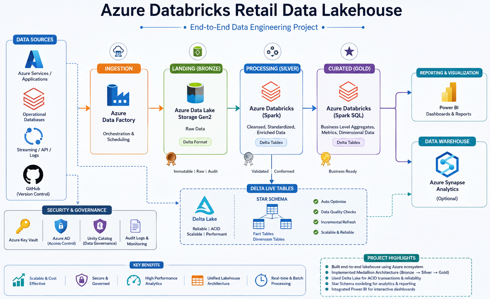

# Real-Time Retail Data Engineering Pipeline using Azure Databricks

## 📌 Project Overview

This project implements an **end-to-end real-time retail data engineering pipeline** using **Azure Databricks, PySpark Structured Streaming, Auto Loader, Avro, and Delta Lake**.

The pipeline continuously ingests newly arriving retail data from cloud storage, processes it incrementally using Spark Structured Streaming, applies data cleansing and transformation logic, and stores the processed data using a **Medallion Architecture**.

The project demonstrates how modern data engineering pipelines can efficiently handle **incremental file ingestion, streaming transformations, scalable processing, and analytics-ready data preparation**.

---

## 🏗️ Architecture


---

## 🛠️ Technology Stack

| Technology                       | Purpose                                    |
| -------------------------------- | ------------------------------------------ |
| **Azure Databricks**             | Data processing and pipeline development   |
| **PySpark**                      | Data transformation and processing         |
| **Spark Structured Streaming**   | Real-time/incremental data processing      |
| **Auto Loader**                  | Incremental file ingestion                 |
| **Avro**                         | Source data format                         |
| **Delta Lake**                   | Reliable storage and ACID transactions     |
| **Azure Data Lake Storage Gen2** | Cloud data storage                         |
| **GitHub**                       | Source code management and version control |

---

## 🔄 Data Pipeline Flow

### 1. Data Ingestion

Retail data arrives as **Avro files** in cloud storage.

Databricks **Auto Loader** detects newly arriving files and incrementally processes them without repeatedly scanning the entire source directory.

```text
New Avro File
     ↓
Auto Loader
     ↓
Spark Structured Streaming
```

---

### 2. Bronze Layer

The Bronze layer stores the ingested data in its raw form using **Delta Lake**.

Key objectives:

* Preserve source data
* Support incremental ingestion
* Maintain streaming processing
* Provide a reliable raw-data layer

```text
Avro
 ↓
Auto Loader
 ↓
Bronze Delta Table
```

---

### 3. Silver Layer

The Silver layer contains cleaned and transformed data.

Transformations include:

* Data type standardization
* Null handling
* Duplicate handling
* Data cleansing
* Column transformations
* Data validation
* Business-related transformations

```text
Bronze
  ↓
PySpark Transformations
  ↓
Silver Delta Tables
```

---

### 4. Gold Layer

The Gold layer contains **business-ready and analytics-ready datasets**.

The processed data can be consumed by downstream reporting and analytics applications.

```text
Silver
  ↓
Business Transformations
  ↓
Gold Delta Tables
  ↓
Reporting / Analytics
```

---

## ⚡ Incremental Data Processing

A major focus of this project is **incremental processing**.

Instead of processing the complete dataset whenever new data arrives, Auto Loader identifies and processes newly arriving files.

This approach helps:

* Reduce unnecessary processing
* Improve scalability
* Handle continuously arriving data
* Build efficient streaming pipelines

---

## 🔥 Auto Loader

Auto Loader is used for scalable and incremental file ingestion.

Conceptually:

```python
df = (
    spark.readStream
    .format("cloudFiles")
    .option("cloudFiles.format", "avro")
    .load(source_path)
)
```

This enables the pipeline to automatically detect and process new files arriving in the source location.

---

## 🌊 Structured Streaming

Spark Structured Streaming is used to process incoming data continuously.

```text
Incoming Data
     ↓
Structured Streaming
     ↓
Transformations
     ↓
Delta Lake
```

The streaming approach allows the pipeline to process data incrementally rather than relying only on traditional batch processing.

---

## 🗄️ Delta Lake

Delta Lake is used as the storage layer for Bronze, Silver, and Gold datasets.

Benefits include:

* ACID transactions
* Reliable data storage
* Schema enforcement
* Schema evolution support
* Efficient incremental processing
* Time travel capabilities

---

## 📂 Project Structure

```text
Real-Time-Retail-Data-Engineering/
│
├── README.md
│
├── notebooks/
│   ├── 01_Bronze_Ingestion
│   ├── 02_Silver_Transformation
│   └── 03_Gold_Transformation
│
├── data/
│   └── sample/
│
├── architecture/
│   └── architecture-diagram.png
│
└── docs/
    └── project-notes.md
```

---

## 🔍 Key Data Engineering Concepts Demonstrated

* Azure Data Lake Storage
* Azure Databricks
* PySpark
* Spark Structured Streaming
* Auto Loader
* Avro
* Delta Lake
* Medallion Architecture
* Incremental Data Processing
* Data Cleansing
* Data Validation
* Streaming Transformations
* Schema Management
* Scalable Data Processing

---

## 🎯 Business Use Case

The pipeline represents a retail analytics scenario where data is continuously generated from retail systems.

Potential downstream use cases include:

* Customer analytics
* Product performance analysis
* Order monitoring
* Sales analytics
* Inventory analysis
* Near-real-time reporting

---

## 🚀 Key Features

* ✅ Incremental file ingestion using Auto Loader
* ✅ Real-time processing using Structured Streaming
* ✅ Avro source data processing
* ✅ Bronze → Silver → Gold architecture
* ✅ Delta Lake-based storage
* ✅ PySpark transformations
* ✅ Data cleansing and validation
* ✅ Scalable streaming pipeline design
* ✅ Analytics-ready Gold datasets

---

## 📈 Future Enhancements

The pipeline can be extended with:

* Azure Data Factory orchestration
* Databricks Workflows
* Unity Catalog governance
* Data quality monitoring
* Pipeline logging and alerting
* Power BI integration
* CI/CD using GitHub Actions
* Slowly Changing Dimensions (SCD Type 2)
* Incremental MERGE/CDC processing

---

## 👨‍💻 Author

**Mohd Rehan**

**Data Engineering | Azure | Databricks | PySpark | SQL**

---

## ⭐ Project Highlights

> **A real-time retail data engineering pipeline built using Azure Databricks, Auto Loader, Spark Structured Streaming, Avro, Delta Lake, and Medallion Architecture to process continuously arriving data and create analytics-ready datasets.**
